# 2023年中国储能产业发展研究报告

# 01 储能市场概览

1.1 发展储能的价值  
1.2 中外储能发展对比  
1.3 中国发展储能驱动力  
1.4 中国储能技术分类  
1.5 中国储能市场发展核心痛点

# 02 中国储能产业发展现状

2.1 中国储能市场产业图谱  
2.2 中国储能技术发展  
2.3储能技术发展与落地应用评价

# 03 中国储能应用案例

3.1 电源侧应用分析  
3.2 电网侧应用分析  
3.3 用户侧应用分析  
3.3.1 家庭  
3.3.2 工商业

# 04 中国储能未来发展趋势

4.1 中国储能未来发展趋势预判  
4.2 中国储能未来发展风险提示

# 电能储能包含机械、化学及电磁等众多技术路线，已有成熟技术进入大规模商业化阶段

$\Leftrightarrow$  储能是指能量的存储，即通过一种介质和设备，把当前剩余的能量以其本身的形式，或者换成另一种能量形式存储起来，根据未来使用的需求，以特定能量形式释放出来的过程。广义上来看，储能包括储电、储热、储气/氢以及化石燃料。本报告核心讨论储电。  
$\Leftrightarrow$  储能技术是通过特定的装置或物理介质将不同形式的能量通过不同方式存储起来，以便以后需要时再次利用的技术。按照存储介质分类，电能存储目前主流的划分方式包括机械储能、化学储能以及电磁储能。

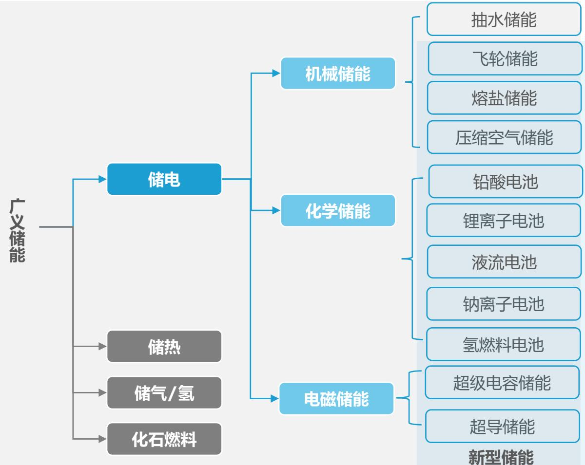  
亿欧智库：储能广义分类

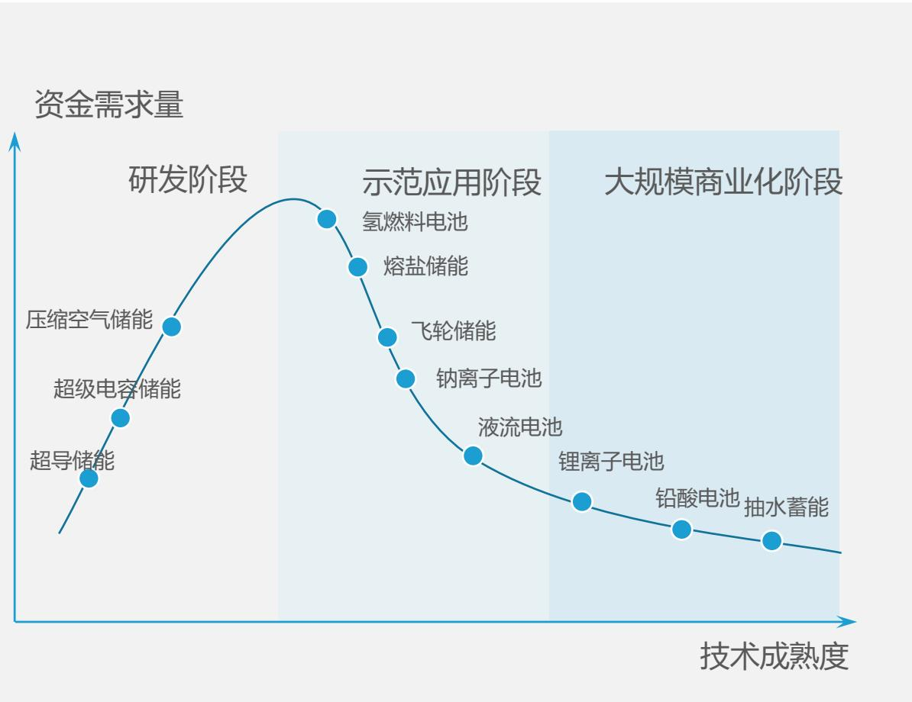  
亿欧智库：储能技术发展曲线

# 实现碳中和成为全球共识，发展储能技术是推进能源结构转型的必要条件

$\Leftrightarrow$  为应对全球气候变化的挑战，目前已有约130个国家和地区提出了碳中和目标，绿色低碳和可持续发展已经成为国际共识。其中，构建以可再生能源为主体的新型电力系统是实现碳中和的重要路径。  
$\Leftrightarrow$  发展储能技术是推进能源结构转型的必要条件，因为可再生能源具有间歇性、波动性和不确定性等特点，导致电力供需平衡难以保证。储能技术可以提高可再生能源的消纳比例，降低对电网的冲击，提升电力系统的灵活性、经济性和安全性。

亿欧智库：全球VRE发电占比将提升至  $15\%$  
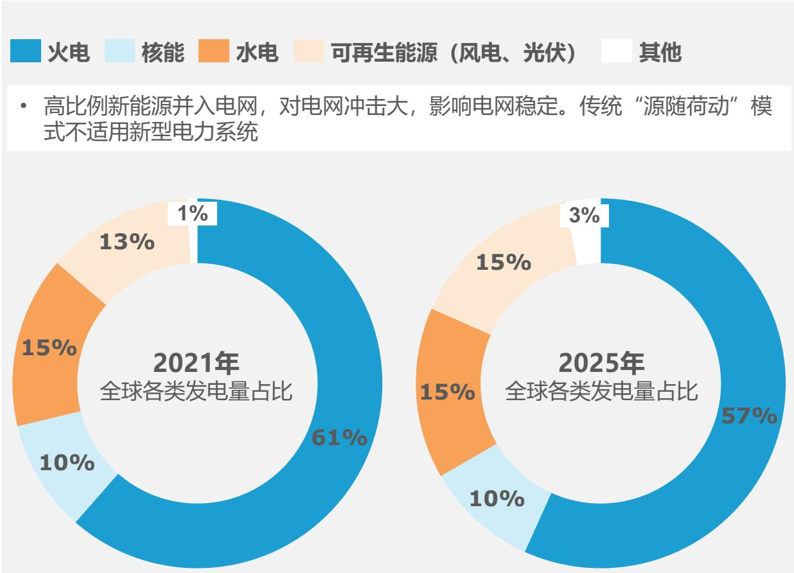  
注：VRE (variable renewable energy) 可控可再生能源

亿欧智库：VRE发电渗透率越高对电力系统的灵活性要求越高  

<table><tr><td>阶段</td><td>VRE发电量渗透率</td><td>对电力系统灵活性的影响</td></tr><tr><td>第一阶段</td><td>0-3%</td><td>·对系统基本没有影响; ·在发电厂的并网点产生极少的局部影响。</td></tr><tr><td>第二阶段</td><td>3-13%</td><td>·负荷与净负荷之间的变化日益明显; ·需要改进系统运行方式,更充分地利用现有系统灵活性资源。</td></tr><tr><td>第三阶段</td><td>13-24%</td><td>·供需平衡难度加大,需要系统性地提高电力系统灵活性; ·现有设施和改进运行方式难以满足灵活性需求,需要对新的灵活性进行投资。</td></tr><tr><td>第四阶段</td><td>23-50%</td><td>·某些时段,VRE发电量足以提供大部分电力需求; ·系统运行需要加强受到扰动后迅造响应的能力; ·VRE也要摄供频率响应服务,如一次调频和二次调频。</td></tr><tr><td>第五阶段</td><td>50%以上</td><td>·VRE发电量经常超过电力需求,出现负净负荷的结构性过则; ·某些时段完全由VRE供应,不需要火电提供负荷; ·需要转移用电需求,以及通过电气化创造新需求增加与相邻系统的电力交换。</td></tr><tr><td>第六阶段</td><td>50%以上</td><td>·主要挑战是在风能和太阳能可用率持续较低时(比如数周)如何满足电力需求; ·需要季节性储能,以及应用氢等合成燃料。</td></tr></table>

# 全球新型储能市场依然由美国、中国和欧洲三大市场引领

从2021年全球新增投运新型储能项目总体来看，美国、中国、欧洲三大市场占据总体市场的  $80\%$  ，其中美国占比  $34\%$  ，中国占比  $24\%$  ，欧洲占比  $22\%$  。值得注意的是，抽水蓄能、电化学储能（电网级）储能市场由中美主导。

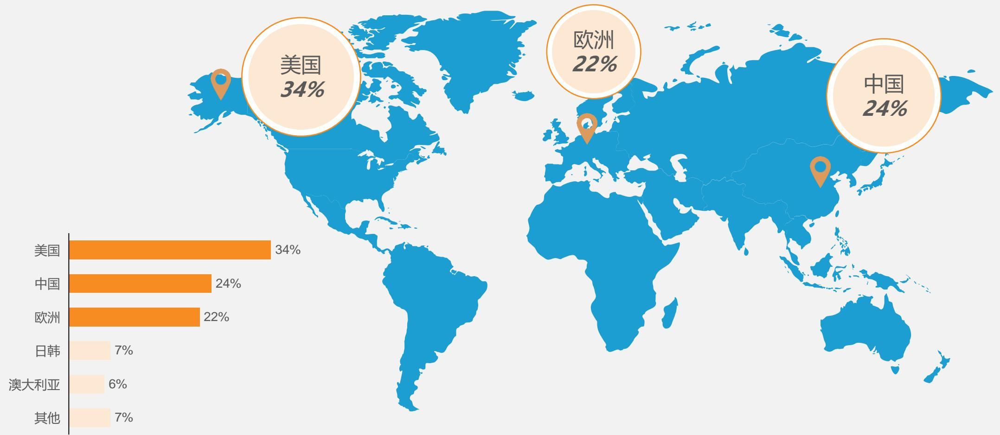  
亿欧智库：2021年全球新增投运新型储能项目各地区功率分布（MW）

# 全球新型储能市场增速可观，抽水蓄能仍是主要储能方式

根据CNESA数据，截至2021年底，全球已投运的（电力）储能项目累计装机规模209.4GW，相较于五年前增长  $19\%$  。抽水蓄能占比高，涨幅较小；储能的增长几乎全部来自于新型储能，五年间占比已达  $12.2\%$  。其中电化学储能为增长主力军，从2017年的2.9GW增长至如今的23GW，占据新型储能市场  $90\%$  以上的份额。

亿欧智库：2017年-2022年全球储能累计装机规模  
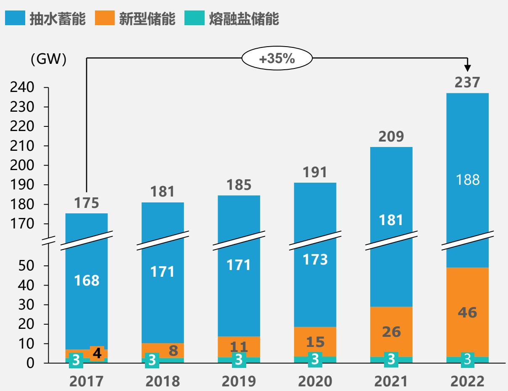  
数据来源：CNESA；亿欧智库

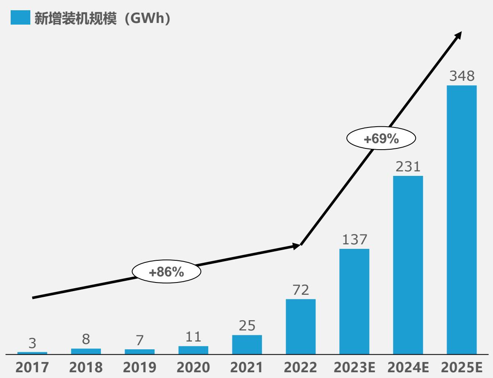  
亿欧智库：2017年-2025E年全球储能市场规模（按新增装机容量计）

# 中国双碳战略目标下能源结构转型加速，储能需求爆发在即

$\diamond$  中国制定目标在2030年前二氧化碳排放量达到峰值，2060年前实现碳中和。我国实现碳中和核心在于能源结构的清洁化、低碳化，能源结构将加速向非化石能源转变。根据全球能源互联网发展合作组织预测，到2025年中国可再生能源发电占比将提升至  $20\%$  。  
$\diamond$  中国正面临电力系统的绿色低碳转型与能源结构的转型。电力结构中，新能源电力的占比在逐渐攀升。新能源出力存在波动大且具有不确定性，其与用电负荷曲线不相匹配，进而加重了常规电源的调节负担。在负荷低谷期间，新能源出力较大，导致电力系统调峰困难；在负荷高峰时段，新能源出力水平较低，导致电网必须采取有序用电措施。新能源发电需要不同的调峰调频手段，储能作为可以作为新能源电力调峰调频的重要利器。许多省份已经发布了新能源配储政策，将配建储能作为新能源并网或核准的前置条件，储能的发展势在必行。

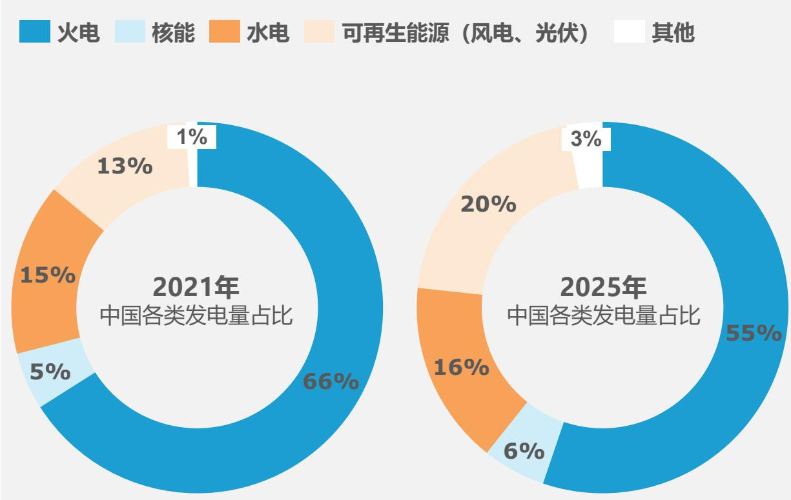  
亿欧智库：中国可再生能源发电占比将提升至20%

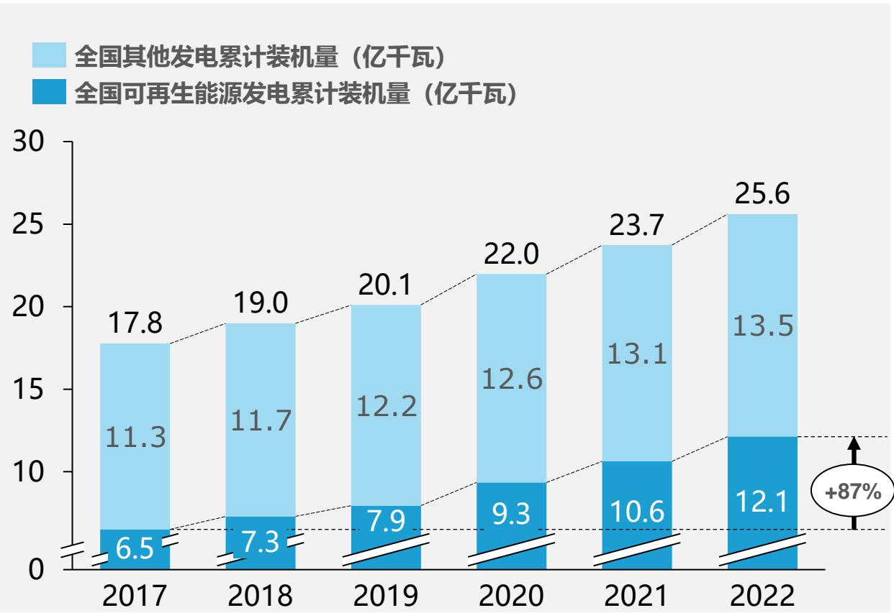  
亿欧智库：2017年-2021年中国可再生能源装机量增长64%

# 近几年，国家层面储能政策高密度出台，助力行业发展

2016年，国家能源局发布《"十三五"规划纲要》，将储能电站、储能设备实施纳入八大重点工程，储能纳入国家级政策规划。2016年至今，储能政策经过的发展期、战略期、新时代三个主要阶段，将"指导意见"落实到"行动计划"。  
$\diamond$  据中关村储能产业技术联盟（CNESA）统计，2021年，国家及地方共出台与储能相关政策300余项，以完善抽水蓄能储能机制，鼓励新型储能为主线，政策主要覆盖电力与工业场景的储能建设。2022年出台290多项储能政策，新型储能的发展成为重点关注对象，与此同时，储能技术、安全标准及认证的完善也提上日程。工业、电力、交通、用户场景的政策中多次提及储能的落地应用。

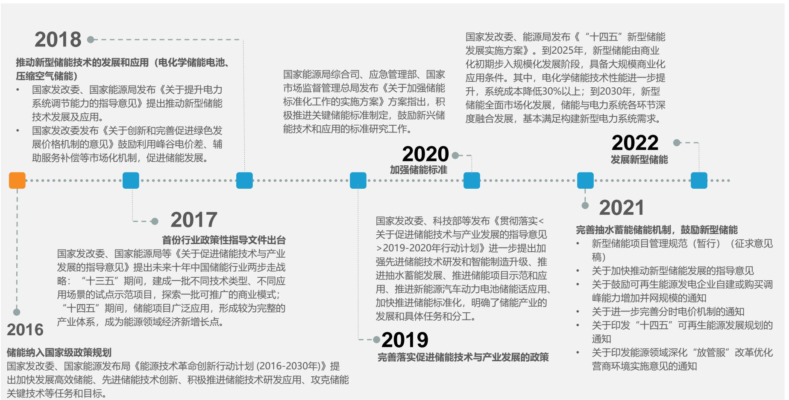  
亿欧智库：2016-2022年储能配套政策不断完善

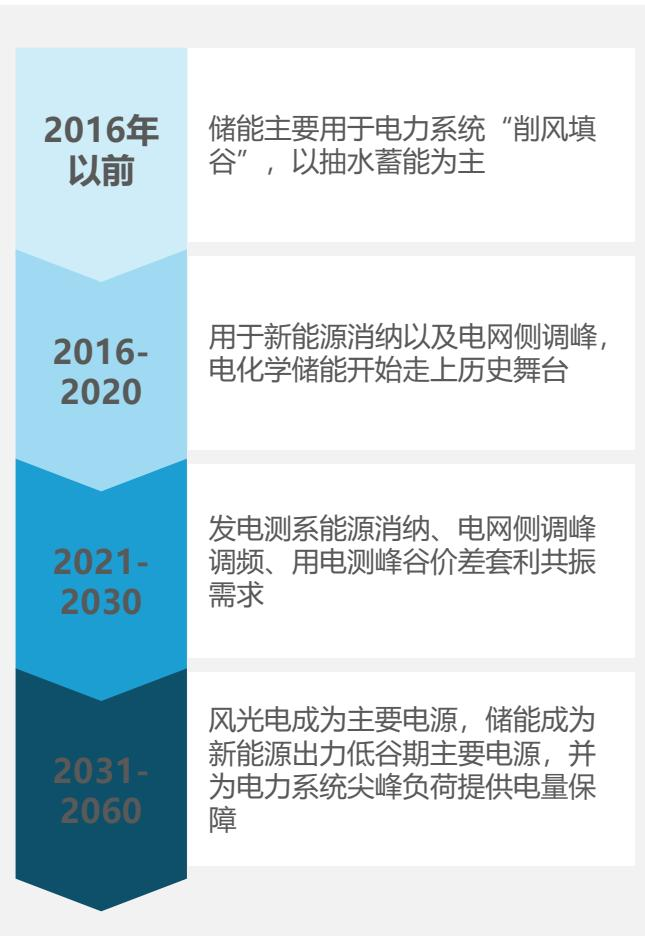  
亿欧智库：中国储能发展阶段

# 中国储能技术的水平快速提升，多数储能技术水平世界领先

$\Leftrightarrow$  储能技术是实现电力系统脱碳的重要支撑，可以改变电能生产、输送和使用必须同步完成的模式，提高电网运行的安全性、经济性和灵活性，成为支撑可再生能源发展的关键技术。近年来国内外的储能相关技术都处于高速发展阶段，成本不断下降。  
$\diamond$  经过"十二五"和"十三五"期间国家和产业的持续投入，中国储能技术的水平快速提升，在关键技术和继承示范方面也均取得重要进展，中国已成为世界储能技术研发和示范的主要核心国家之一。压缩空气储能、储热储能、铅蓄电池、锂离子电池、液流电池和钠离子电池已达到或接近世界先进水平；抽水蓄能、飞轮储能、超级电容器和储能新技术和世界先进水平还有一定差距，但总体差距在逐步缩小。

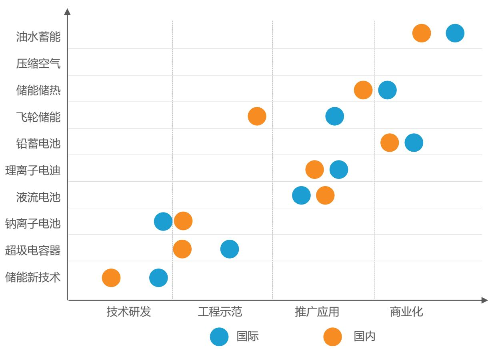  
亿欧智库：中国和世界主要储能技术水平对比

亿欧智库：中国在主要储能技术上的研发和应用进展  

<table><tr><td>储能技术</td><td>中国研发和应用进展</td></tr><tr><td>抽水储能</td><td>超高水头、超大容量抽水蓄能实现了跨越式发展，定速抽蓄世界领先，变速抽蓄与国外有较大差距。</td></tr><tr><td>压缩空气</td><td>10-100MW储能系统取得里程碑式进展，张家口首套100MW压缩空气储能项目达到世界引领水平。</td></tr><tr><td>储热储冷</td><td>高温熔盐储热、大容量跨季节储热和储冷、热泵储热、卡诺电池以及电化学储热是当前储热研究的热点。</td></tr><tr><td>飞轮储能</td><td>大容器功率型飞轮储能取得阶段性进展，缩小了与国际先进水平的差距，为10MW以上项目应用奠定基础。</td></tr><tr><td>铅蓄电池</td><td>技术研发主要集中在铅炭电池，通过在负极添加高活性的碳材料，抑制负极硫酸盐化引起的容量快速衰减。</td></tr><tr><td>锂离子电池</td><td>正负极材料、快充技术、固态电池等取得重要突破，锂补偿技术、无模组技术和刀片电池是技术进展亮点。</td></tr><tr><td>液流电池</td><td>全钒液流电池是主流技术，解决规模化、成本、效率等问题是研究热点，锌溴、铁铬液流电池正在探索。</td></tr><tr><td>钠离子电池</td><td>最接近锂离子电池的电池技术，基础研究、技术水平和集成示范均取得重要进展，已处于国际领先水平。</td></tr><tr><td>超级电容器</td><td>在关键材料、单体技术、成组管控、系统集成与应用和使役性能进行全链条技术攻关，并实现规模示范。</td></tr><tr><td>新型储能</td><td>研究重点是液态金属电池、多价金属离子电池和水系电池的材料研究，相关单体、模组等正在深入研究。</td></tr></table>

# 抽水蓄能仍是中国主要储能技术，新型储能技术中电化学增速迅猛

根据CNESA全球储能项目库的不完全统计，截至2021年底，中国已投运电力储能项目累计装机规模46.1GW，占全球市场总规模的  $22\%$  ，同比增长  $30\%$  。其中，抽水蓄能的累计装机规模最大（占比  $86.3\%$ ），为39.8GW；市场增量主要来自电化学储能，累计装机规模达到5729.7MW，同比增长  $75\%$  。

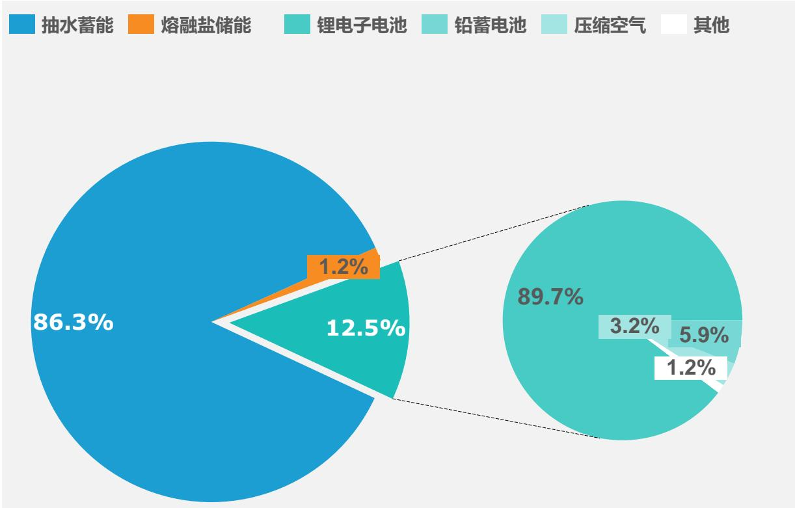  
亿欧智库：2021年中国储能技术占比

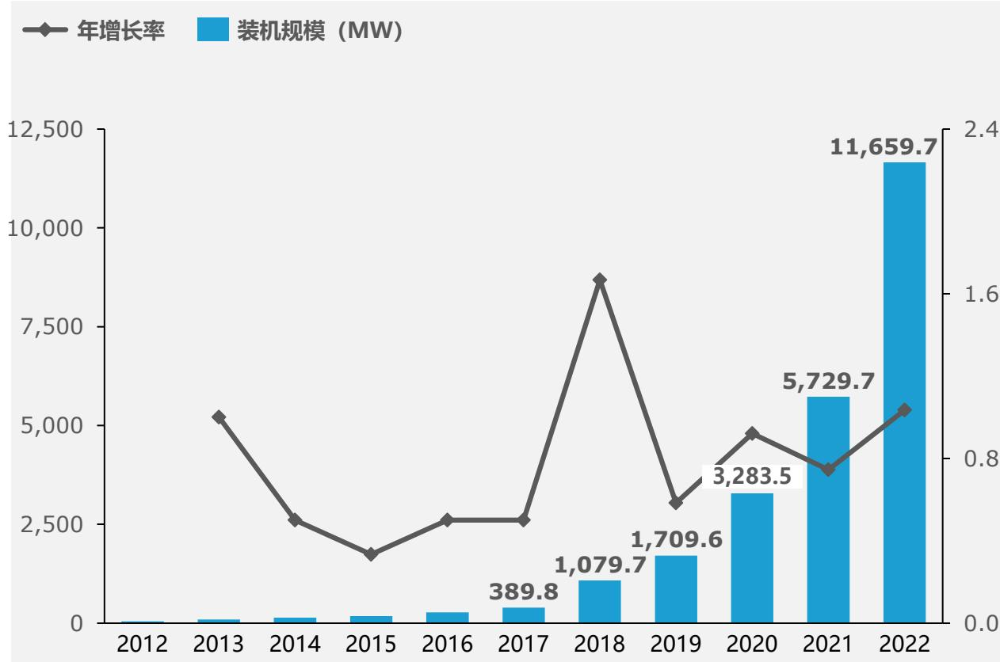  
亿欧智库：中国电化学储能市场累计装机规模

# 经济性与安全性是制约中国储能产业发展的核心因素

$\Leftrightarrow$  在储能技术的发展过程中，经济性是影响储能推广的重要因素之一，原有高上网电价且存在弃光弃风的电站、高峰谷电价差以及储能扶持政策地区的储能项目自发需求或将逐步释放。此外，对于储能行业，工程层面的技术-经济先进性依然是最重要的因素之一。  
$\Leftrightarrow$  另外，安全性也是制约中国储能产业发展的核心因素之一。随着中国储能装机规模跃至全球第一，消防安全紧握产业发展"命脉"。在储能产业高速发展的同时，储能的安全建设和运行压力也在不断增加。

亿欧智库：成熟储能技术优缺点对比  

<table><tr><td></td><td>抽水蓄能</td><td>压缩空气储能</td><td>飞轮储能</td><td>锂电子电池</td></tr><tr><td>优点</td><td>·可靠性高
·经济性高
·寿命长
·容量大
·技术成熟</td><td>·经济性高</td><td>·寿命长
·充放电次数高
·响应速度快
·功率变化能力快</td><td>·比能量高
·技术成熟
·响应速度快
·效率高</td></tr><tr><td>缺点</td><td>·选址依赖地理条件
·投资额高</td><td>·能量转换损耗导致效率偏低</td><td>·度电成本高</td><td>·价格高
·存在发热问题</td></tr><tr><td>应用场景</td><td>·调峰
·调频
·事故备用</td><td>·调峰且适用于大规模风场</td><td>·UPS
·电网调频</td><td>·调峰
·调频
·备用容量</td></tr></table>

机械储能存在一定外部制约因素，电化学储能经济性提升降低LCOS是关键

Capex+Opex-残值 更长的循环寿命 LCOS= 循环寿命*系统能量效率 更高的系统效率 更低的资本投入

亿欧智库：2019-2022年储能项目部分重大事故  

<table><tr><td>国家</td><td>事故时间</td><td>事故类型</td><td>储能技术</td><td>装机容量（MWh）</td></tr><tr><td>美国</td><td>2022</td><td>充电中</td><td>三元锂电池</td><td>182.5</td></tr><tr><td>韩国</td><td>2022</td><td>充电中</td><td>三元锂电池</td><td>1.5</td></tr><tr><td>澳大利亚</td><td>2021</td><td>冷却液泄露导致电池单体热失控</td><td>三元锂电池</td><td>450</td></tr><tr><td>中国</td><td>2021</td><td>充电中</td><td>磷酸铁锂电池</td><td>25</td></tr><tr><td>韩国</td><td>2019</td><td>充电后休止</td><td>三元锂电池</td><td>1.027</td></tr><tr><td>韩国</td><td>2019</td><td>充电后休止</td><td>三元锂电池</td><td>3.66</td></tr><tr><td>韩国</td><td>2019</td><td>充电后休止</td><td>三元锂电池</td><td>46.757</td></tr><tr><td>韩国</td><td>2019</td><td>充电后休止</td><td>三元锂电池</td><td>2.496</td></tr><tr><td>韩国</td><td>2019</td><td>充电后休止</td><td>三元锂电池</td><td>5.22</td></tr><tr><td>韩国</td><td>2019</td><td>充电后休止</td><td>三元锂电池</td><td>3.289</td></tr></table>

# 中国储能市场产业图谱

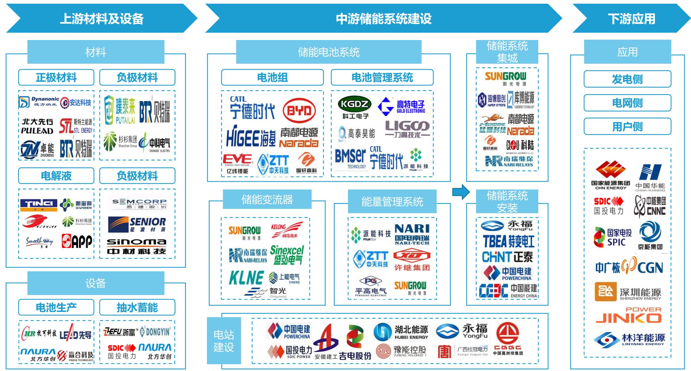

# 国内储能新增装机按技术分类，成四大梯队分布

$\diamond$  截止到2021年底，2021年我国新增电力储能装机继续保持高速增长，新增投运规模达10.5GW，同比增长  $220\%$  。新增最多的是抽水蓄能，单机规模100MW以上，占年度新增装机  $79\%$  左右，位列第一梯队。其次是锂离子电池、压缩空气储能、液流电池、铅蓄电池、储热储冷技术，单机可达10-100MW，位列第二梯队。第三梯队是钠离子电池、飞轮储能、超级电容器，目前单机容量已达到MW级，其中钠离子发展受关注最多，未来可能进入第二梯队。第四梯队是是液态金属、金属离子电池、水系电池等新型储能技术，需要进一步的研发，以尽早实现集成释放和产业化应用。  
$\diamond$  中国储能企业主要包括储能技术提供商、储能PCS提供商、储能系统集成商三大类。

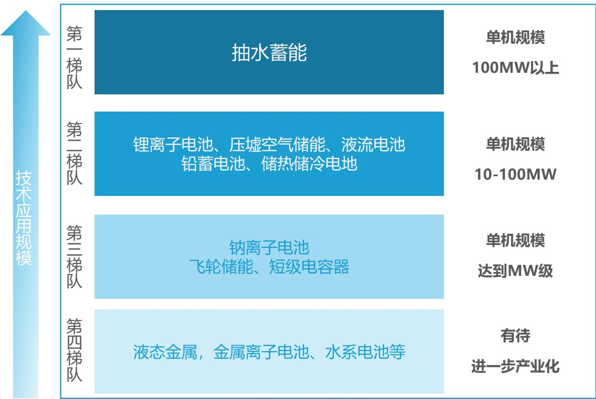  
亿欧智库：中国储能新增装机梯队划分（技术分类）

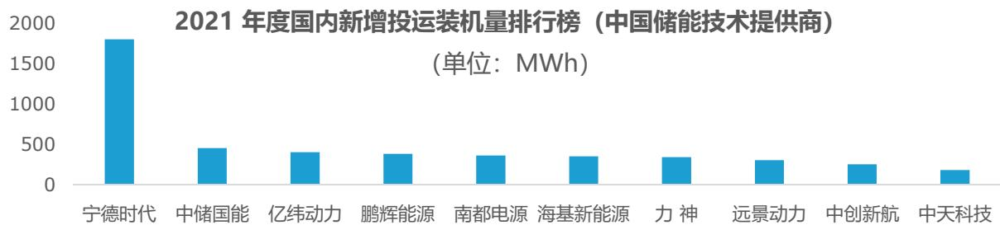

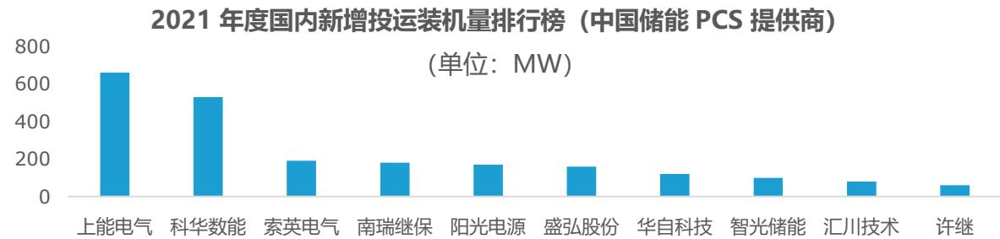

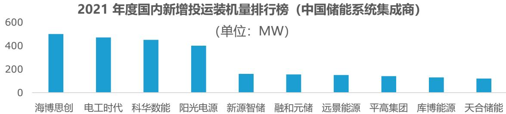

# 储能技术不同类型及特点

$\Leftrightarrow$  储能技术是通过装置或物理介质将能量储存起来以便以后需要时利用的技术。根据技术类型的不同，以电能释放的储能方式主要分为机械储能、电磁储能和电化学储能。机械类储能的应用形式为抽水蓄能、压缩空气储能和飞轮储能；电磁储能的应用形式为超级电容储能和超导储能；电化学类储能主要包括铅蓄电池、锂离子电池和液流电池等储能方式。  
$\Leftrightarrow$  不同储能技术具有不同的特性，包括响应时间、放电时长、综合效率，相应的技术成熟度和应用场景也有所差异。不同储能技术路线利弊兼有，却不影响其"百花齐放"。随着碳达峰、碳中和目标的提出，储能产业驶入发展快车道，成为构建新型电力系统的重要支撑。

亿欧智库：不同储能技术类型和主要特点  

<table><tr><td>分类</td><td>储能技术</td><td>适用储能时长</td><td>响应时间</td><td>放电时长</td><td>综合效率/%</td><td>寿命:年</td><td>技术成熟度</td><td>应用场景</td></tr><tr><td rowspan="3">① 机械储能</td><td>抽水蓄能</td><td>长时</td><td>s-min级</td><td>1-24h</td><td>75-85</td><td>40-60</td><td>成熟</td><td>调峰、备用</td></tr><tr><td>空气储能</td><td>长时</td><td>min级</td><td>1-24h</td><td>70-89</td><td>20-40</td><td>成熟</td><td>调峰、备用</td></tr><tr><td>飞轮储能</td><td>短时</td><td>ms-min级</td><td>ms-15min</td><td>93-95</td><td>15+</td><td>商业化早期</td><td>调频、平滑波动</td></tr><tr><td rowspan="4">② 电化学储能</td><td>铅蓄电池</td><td>短时</td><td>ms-min级</td><td>ms-h</td><td>75-90</td><td>5</td><td>商业化</td><td>调峰、调频、通讯基站备用电源</td></tr><tr><td>钠硫电池</td><td>短时</td><td>ms级</td><td>s-h级</td><td>80-90</td><td>10-15</td><td>商业化</td><td>调峰、调频、能量管理、备用</td></tr><tr><td>液流电池</td><td>短时/长时</td><td>ms级</td><td>s-h级</td><td>60-85</td><td>5-10</td><td>商业化早期</td><td>调峰、调频、能量管理、备用</td></tr><tr><td>锂离子电池</td><td>短时/长时</td><td>ms-min级</td><td>ms-h级</td><td>98-95</td><td>5-15</td><td>商业化</td><td>调峰、调频、能量管理、备用</td></tr><tr><td rowspan="2">③ 电磁储能</td><td>超导储能</td><td>短时</td><td>&lt;100 ms</td><td>ms-8s</td><td>95-98</td><td>20+</td><td>开发阶段</td><td>调频、平滑波动</td></tr><tr><td>超级电容</td><td>短时</td><td>ms级</td><td>ms-60min</td><td>90-95</td><td>20+</td><td>开发阶段</td><td>调频、平滑波动</td></tr></table>

数据来源：公开材料；亿欧智库

# 抽水蓄能：中国作为抽水蓄能大国，进入发展高峰期

$\Leftrightarrow$  抽水蓄能是一种大规模的储能方法，即通过电能- 水势能的转化进行能源储存。抽水蓄能是在用电低谷时将电能转化为上游水库水的势能，在用电高峰时通过水轮发电机将水的势能转化为电能，其储能总量同水库的落差和容积成正比。  
$\Leftrightarrow$  抽水蓄能电站自1882年问世至今拥有140年的历史，中国是从20世纪六七十年代拉开抽水蓄能电站建设的序幕。"十二五"、"十三五"期间，为适应新能源、特高压电网快速发展，抽水蓄能发展迎来新的高峰。截至2020年底，全球已投运的抽水蓄能装机为1.725亿千瓦，其中中国抽水蓄能装机达到3149万千瓦，占比超过  $18\%$  ，位居世界第一。

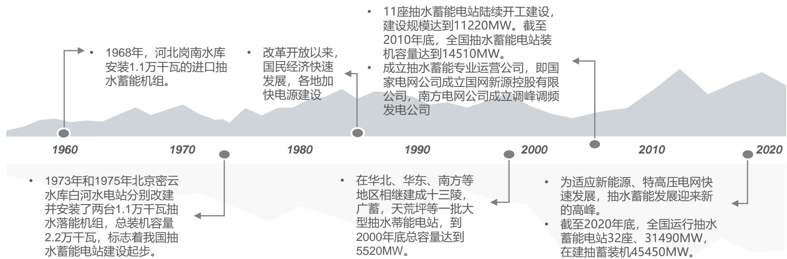  
亿欧智库：抽水蓄能发展历程

# 起步期

- 解决电力匮乏问题，保证大电网安全，电站建成，设备多源自进口，但总体发展缓慢

# 发展期

电力负荷迅速增长，调峰需求剧增，抽水蓄能电站全国范围内迅速铺设  
- 专门建设、运营抽水蓄能电站  
厂网分离

# 高峰期

储能概念受到关注，成为中国主要储能方式，正在实现零部件全面国产化的路上

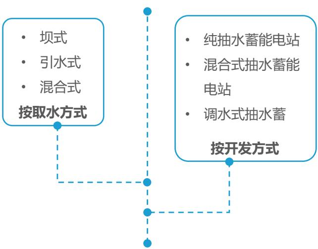  
亿欧智库：抽水蓄能分类

- 分置式（四机式）  
串联式（三机式）  
- 可逆式（两机式）按机组形式

# 抽水蓄能：技术成熟但建设受限，需求和电价机制是制约发展的主要因素

$\Leftrightarrow$  抽水蓄能是当前储能规模最大（GW级）、技术最成熟、使用寿命最长（50a左右）和经济性最优（度电成本0.21-0.25元/kWh）的物理储能技术。这种低吸高发的储能模式主要应用于电网调峰填谷、调频调相、紧急事故备用和黑启动等场合，可进行"水光互补"，有效调节电力系统的动态平衡，提高电网系统的综合运行效率达  $70\% \sim 85\%$  。  
基于其技术成熟，循环次数多，使用寿命长且损耗低等特点，抽蓄电站的度电成本优势较大，但是抽水蓄能资源总量有限，站址选择受地理条件限制，建设周期长，投资成本呈逐年升高趋势，需求和电价机制是制约抽蓄发展的主要因素。

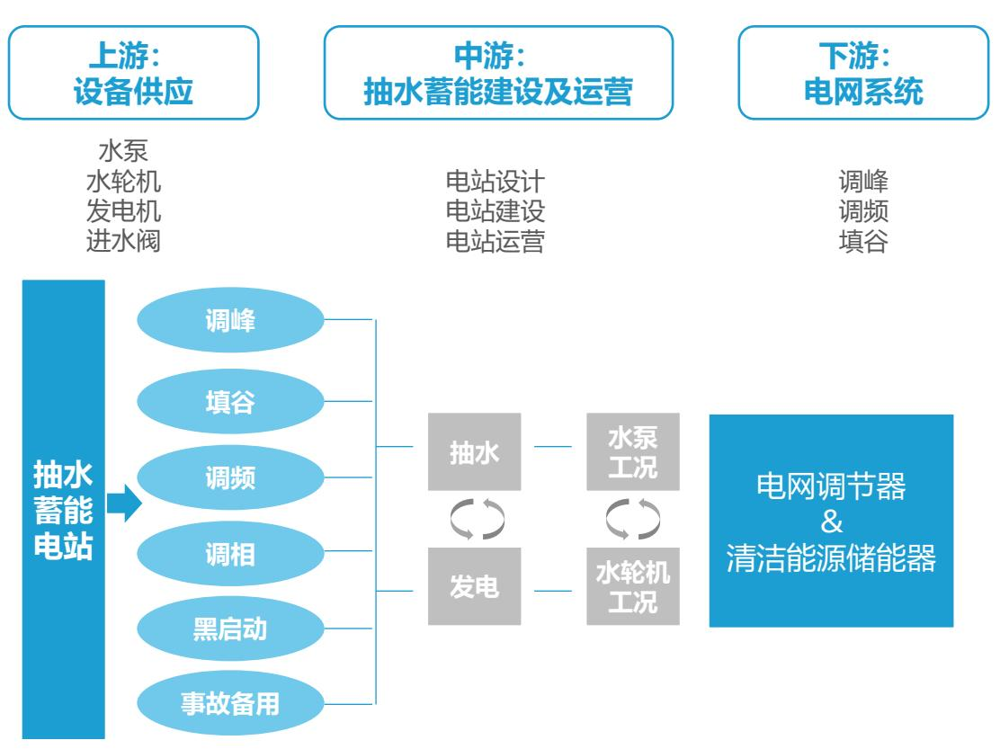  
亿欧智库：抽水蓄能电站在电力系统中的作用

# 限制因素

# 需求

过去的电力贡献大多来自火电，虽然用电量不断增长，但火电电源稳定性强，水电本身又具备调峰调频的功能，电网对于储能的需求并不是非常急迫。

# 电价机制

抽蓄电站的成本一直无法顺利传导，电网投资意愿不强。另外，抽蓄电站的盈利和电网运营利润捆绑式计算，导致社会资本参与度也较低。

# 站址限制

抽水蓄能对地理因素的要求很高，需要合适的地理条件建造水库和水坝，需要有合适的水源条件、地形条件、地质条件、环境条件，建设周期长。

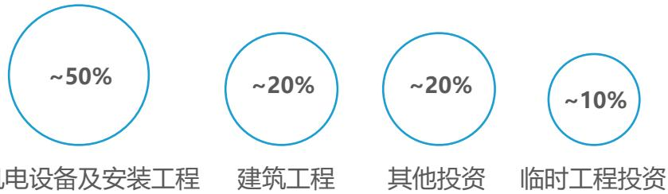  
抽水蓄能电站投资构成

# 飞轮蓄能：处于发展阶段，未来应用有待突破

$\Leftrightarrow$  在目前适合规模化商业运行的储能技术中，飞轮储能具有功率密度高、充放电响应速度快、使用寿命长、放电深度大、无环境污染、运营成本低、安全风险小等综合优势，非常适合快速大功率充放电应用场合。  
从目前飞轮储能技术的发展来看，目前中国市场上飞轮储能应用大部分为试点产品，成熟运行产品较少，运行功率较低，后备时间极短，部分技术性能需要进一步完善。在系统容量、转换率、使用寿命、安全性等方面亟须创新和突破。同时，飞轮储能商业化还存在成本偏高、缺少价格激励政策、技术路线不够成熟、欠缺技术规范和接入标准等问题。

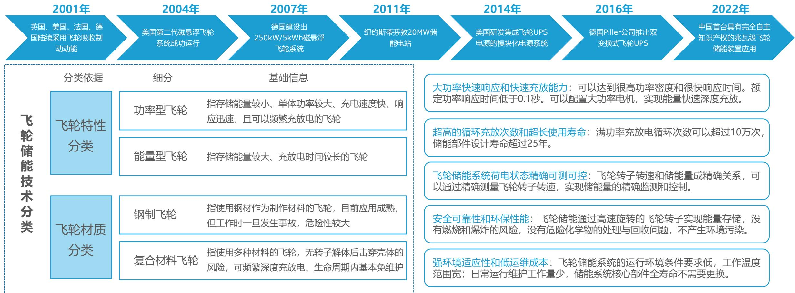  
亿欧智库：飞轮蓄能发展历程

# 压缩空气储能：新技术推广使效率显著提升，初具大规模商业化条件

$\Leftrightarrow$  压缩空气储能系统是以高压空气压力能作为能量储存形式，并在需要时通过高压空气膨胀做功来发电的系统。传统压缩空气储能系统的效率提升空间十分有限，国内外学者在传统压缩空气储能的基础上，通过采用优化热力循环等方法，开拓出了多种新型的压缩空气储能技术，新技术推广使效率显著提升，效率与成本已和抽水蓄能相当，初具大规模商业化条件。  
$\Leftrightarrow$  目前最主要的新型压缩空气储能系统主要有三个新的技术路径:蓄热式压缩空气储能(TS-CAES)、液态压缩空气储能系统(LAES)、超临界压缩空气储能系统(SC-CAES)。

亿欧智库：不同技术路径空气储能系统的优缺点对比  

<table><tr><td>技术路径</td><td>优点</td><td>缺点</td></tr><tr><td>蓄热式压缩空气储能(TS-CAES)</td><td>1)不需要补燃，节约化石燃料2)能量回收以提高系统效率3)可利用外界热源以进一步提高效率4)技术较成熟，我们认为初具商业化条件</td><td>增加多级换热及储热，占地面积和投资有所增加</td></tr><tr><td>液态压缩空气储能(LAES)</td><td>1)不受地理环境限制2)能量密度大</td><td>依赖化石燃料输入，系统性能受回热器的影响较大</td></tr><tr><td>超临界压缩空气储能(SC-CAES)</td><td>1)效率高2)能量密度高破3)不需要补燃，节约化石燃料</td><td>技术仍有待突</td></tr></table>

# 效率提升+成本下降

> 效率提升：从目前装机项目来看，兆瓦级的系统效率可达  $52.1\%$  ，10兆瓦的系统效率可达  $60.2\%$  百兆瓦级别以上的系统设计效率可以达到  $70\%$  ，先进压缩空气储能系统效率能够逼近  $75\%$  ，效率已经和抽水蓄能(约为  $79\%$  )相当。  
> 成本下降：系统规模增加后，单位投资成本也持续下降，系统规模每提高一个数量级，单位成本下降可达  $30\%$  左右。当前压缩空气储能目前每千瓦的造价大概是5000到6000元，已接近抽水蓄能的建设成本(约5500元/kW)，随着未来系统规模的提升、产业链的规模效应的形成，仍有较大的成本下降空间。

# 蓄热式短期内有望迎来大规模商业化

不依赖化石燃料、效率较高

具备较为成熟的技术

我国有大量的盐洞、废弃矿洞

# 锂离子电池：目前储能应用中最主要的技术路线，处于绝对主导地位

$\Leftrightarrow$  锂离子电池的能量密度较高，循环寿命长，效率高，响应速度快，是目前储能应用中最主要的技术路线。自2015年以来，锂离子电池主宰着储能市场，从2022年新增储能装机技术占比来看，锂离子电池储能技术占比达  $94.2\%$  ，仍处于绝对主导地位。  
从种类来说，磷酸铁（LFP），镍锰钴（NMC）等三元锂占比75%以上。磷酸铁锂电池能量密度高、循环寿命较长、自放电率低、能量转化率高、进行快速充放电、不需要维护，电池成本低、寿命长，已成为国内主流路线，具有较强的经济性。

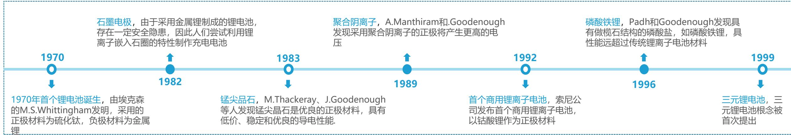  
亿欧智库：锂离子电池发展历程

<table><tr><td rowspan="11">锂离子电池分类</td><td rowspan="4">按正极材料</td><td rowspan="4">·铁酸锂电池
·钴酸锂电池
·锰酸锂电池
·镍酸锂电池
·三元材料锂电池</td><td>类型</td><td>磷酸铁锂（LFP）</td><td>磷酸锰铁锂（LMFP）</td><td>镍钴锂三元（NCM）</td><td>镍钴铝三元（NCA）</td></tr><tr><td>结构</td><td>橄榄石</td><td>橄榄石</td><td>层状</td><td>层状</td></tr><tr><td>正极材料资源</td><td>磷铁资源丰富</td><td>磷铁资源丰富</td><td>钴资源贫乏</td><td>钴资源贫乏</td></tr><tr><td>正极合成工艺</td><td>较难</td><td>较难</td><td>较难</td><td>难</td></tr><tr><td rowspan="4">按电解质材料</td><td rowspan="4">·液态锂电池
·固态聚合物锂电池</td><td>循环寿命（次）</td><td>4000-6000</td><td>-</td><td>2000-3000</td><td>2000-3000</td></tr><tr><td>充电速度</td><td>较慢</td><td>较慢</td><td>快</td><td>快</td></tr><tr><td>安全性能</td><td>优</td><td>优</td><td>良</td><td>良</td></tr><tr><td>倍率性能</td><td>一般</td><td>较优</td><td>优</td><td>优</td></tr><tr><td rowspan="3">按应用分类</td><td rowspan="3">·动力型电池
·消费型电池
·储能型电池</td><td>综合成本</td><td>低</td><td>较低</td><td>高</td><td>高</td></tr><tr><td>优点</td><td>安全性好，循环寿命长，成本低</td><td>安全性好，比容量高，成本低</td><td>比容量高；倍率性好</td><td>比容量高；倍率性好</td></tr><tr><td>缺点</td><td>能力密度低，低温性能差</td><td>存在两个电压平台</td><td>安全性低，循环寿命短</td><td>安全性低，循环寿命短</td></tr></table>

数据来源：公开材料；亿欧智库

# 钠离子电池：具备成本低、资源丰富特点，未来产业化是大势所趋

钠离子电池与锂离子电池工作原理相同，是锂离子电池的重要补充。其上游资源储量充沛低廉，生产工艺与锂离子电池类似，量产成本比锂离子电池低  $35\%$  左右。目前仍在量产阶段中，具备成本低、资源丰富、低温性能佳、倍率性能好等特点，提到的能量密度、充放电效率等重要性能指标均有待验证。目前中国开展了多个钠离子电池材料、电芯生产制造示范区，量产持续推进中。钠离子电池的生产工艺与锂离子电池趋同，技术可复刻，设备可迁移，钠离子产业化时间有望进一步提前。

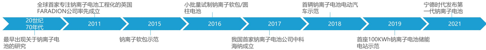  
亿欧智库：钠离子电池发展历程

钠离子电池与锂离子电池材料体系对比  

<table><tr><td>材料与设备</td><td>锂离子电池</td><td>钠离子电池</td></tr><tr><td>正极材料</td><td>磷酸铁锂、三元材料等</td><td>铁锰铜/镍三元体系、碳酸体系、硫酸体系、普鲁士蓝类化合物等</td></tr><tr><td>负极材料</td><td>石墨</td><td>碳类材料、金属氧化物、磷基材料</td></tr><tr><td>电解液</td><td>六氟磷酸锂</td><td>六氟磷酸钠</td></tr><tr><td>隔膜</td><td>无变化</td><td>无变化</td></tr><tr><td>集流体</td><td>铜箔</td><td>铝箔</td></tr><tr><td>设备</td><td>无变化</td><td>无变化</td></tr></table>

从材料体系来看，除了隔膜/设备以外，其他各材料组分均有明显变化，特别是正负极材料变化明显。

成本下降约30%↓

# 钠离子电池优劣势

# 优势：性能好，安全性能高

> 性能好：具备优异的低温性能、倍率性能。快充性能更好，试验调价年充电速度优于正常状态下锂离子电池。此外钠离子电池正常工作温度范围在-40°C-80°C，部分产品在-20°C下容量保持率能够达到88%。  
> 安全性能高：钠离子电池内阻高，在电池短路时电路中电流更低，瞬间发热更少。钠离子电池经历短路、针刺、挤压等测试后，无起火、无爆炸。钠电池在热失控时容易钝化失活，因而安全测试表现更优。

# 劣势：循环寿命、能量密度尚有改善空间

> 循环寿命有待考证：钠离子电池现在整体循环寿命在2000次左右，比磷酸铁锂电池表现略差，相较于部分用于储能领域的循环寿命超5000次的磷酸铁锂电池而言仍有一定差距。  
> 能量密度有待考证：钠创新能源钠离子电芯能量密度超130Wh/kg，立方新能源产品电芯能量密度为140Wh/kg，中科海钠产品能量密度为145Wh/kg，仍有进一步优化的空间；宁德时代最新第二代钠电池设计能量密度可达到200Wh/kg。

# 氢燃料电池：碳中和背景下，发展趋势向好，商业化前景广阔

$\Leftrightarrow$  氢燃料电池是将氢气和氧气的化学能直接转换成电能的发电装置。其基本原理是电解水的逆反应，把氢和氧分别供给阳极和阴极，氢通过阳极向外扩散和电解质发生反应后，放出电子通过外部的负载到达阴极。在实现碳中和的目标背景下，发展氢能成为实现能源战略转型的必经之路。  
$\Leftrightarrow$  氢燃料电池由于其燃料气来源丰富、效率高、无噪声、无污染的优点，将在未来为节能和保护生态环境做出巨大贡献，是目前各个国家重点进行研究的发电技术。

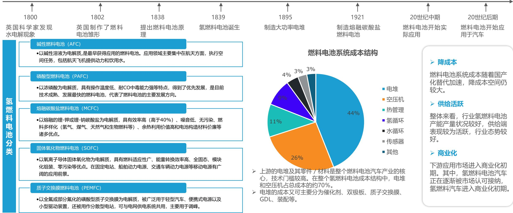  
亿欧智库：氢燃料电池发展历程

$\Leftrightarrow$  电磁储能的应用形式分为超级电容器储能和超导储能。尚处于技术发展的初级阶段，存在成本较高的缺点。  
$\diamond$  超级电容储能：因高功率、高可靠特性突出，超级电容适用于高功率、短时高频储能领域，而能量密度较低、储能成本较高是限制其应用范围的两大因素，未来，技术进步、成本降低、政策驱动三重利好有望共同推动超级电容市场高速增长。  
$\diamond$  超导储能：超导磁储能拥有巨大发展空间，但面临着技术可行性、经济价值挑战。

# 超级电容储能

根据电化学双电层理论研制而成的，又称双电层电容器，两电荷层的距离非常小（一般0.5mm以下），采用特殊电极结构，使电极表面积成万倍的增加，从而产生极大的电容量。

# 优点

- 寿命长、循环次数多，效率高  
充放电时间快、响应速度快  
- 维护少、无旋转部件  
- 运行温度范围广，环境友好

# 缺点

- 电介质耐压很低，储存能量较少  
能量密度低  
投资成本高  
- 有一定的自放电率

超级电容器储能开发已有50多年的历史，近二十年来技术进步很快，使它的电容量与传统电容相比大大增加，达到几千法拉的量级，而且比功率密度可达到传统电容的十倍。超级电容器储能将电能直接储存在电场中，无能量形式转换，充放电时间快，适合用于改善电能质量。由于能量密度较低，适合与其他储能手段联合使用。

# 超导储能

超导磁储能是利用超导体的电阻为零特性制成的储存电能的装置，其不仅可以在超导体电感线圈内无损耗地储存电能，还可以通过电力电子换流器与外部系统快速交换有功和无功功率，用于提高电力系统稳定性、改

善供电品质。

# 优点

- 由于直接将电能储存在磁场中，并无能量形式转换，能量的充放电非常快（几毫秒至几十毫秒），功率密度很高  
- 极快的响应速度，可改善配电网的电能质量，

# 缺点

- 超导所使用的材料价格昂贵  
- 能量密度低（只能维持秒级）  
- 维持低温制冷运行需要大量能量  
- 应用有限

超导储能适合用于提高电能质量，增加系统阻尼，改善系统稳定性能，特别是用于抑制低频功率振荡。但是由于其格昂贵和维护复杂，虽然已有商业性的低温和高温超导储能产品可用，在电网中应用很少，大多是试验性的。SMES在电力系统中的应用取决于超导技术的发展，特别是材料、制冷、电力电子等方面技术的发展。

# 储能技术发展与落地应用评价指标体系

$\Leftrightarrow$  根据亿欧智库研究，储能技术发展与落地应用评价指标体系围绕技术特性指标、经济特性指标、产业化能力指标三大评价维度，12个细分指标进行评价。

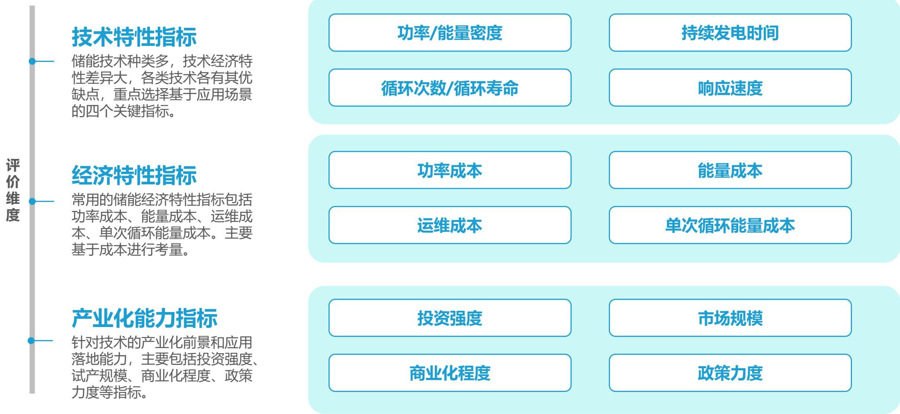  
亿欧智库：储能技术发展与落地应用评价指标体系

# 储能技术发展与落地应用市场扫描

从技术先进性和应用落地性两个维度，基于细分指标，对储能技术市场进行扫描。当前中国储能技术企业主要分为实力引领型、稳健发展型、潜力发展型三类企业。

<table><tr><td>维度</td><td>指标及解释</td></tr><tr><td>技术先进性</td><td>• 功率/能量密度：密度越高，技术先进性数值越大
• 循环寿命/循环次数：循环越多，技术先进性数值越大
• 功率/能量成本：成本越低，技术先进性数值越大</td></tr><tr><td>应用落地性</td><td>• 市场规模：市场规模越大，应用落地性数值越大
• 商业化程度：商业化程度越高，应用落地性数值越大
• 政策力度：政策力度越强，应用落地性数值越大</td></tr></table>

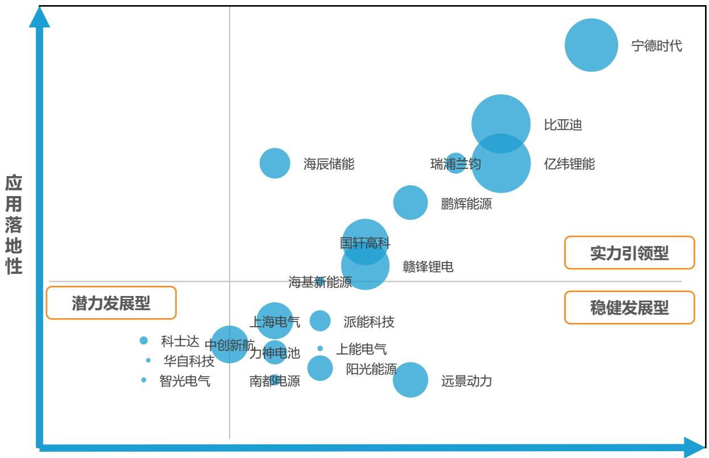  
技术先进性

# 机械储能与电化学储能协同发展，新型储能应用场景丰富，商业化未完全成熟但发展势头好

$\diamond$  在"双碳"目标驱动下，政策大力推动绿色能源发展，构建以新能源为主体的新型电力系统，以智能电网侧为枢纽平台，以源网荷储互动与多能互补为支撑，集中式与分布式电力结构并举，积极推动电力资源的有序供应，扩大覆盖面。  
$\diamond$  基于目前电力市场，围绕能源的产生和消耗，大体可分为电源侧、电网侧和用户侧，而用户侧又涵盖工商业与家庭用户。

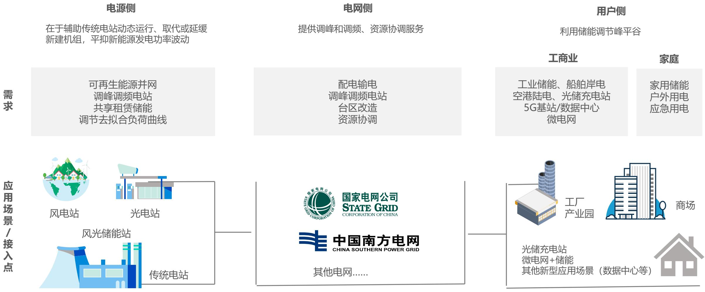

# 商业模式：从单一走向多元，以政策为导向逐步发展为多环节商业模式

2022年起政策密集出台，储能在电力体系中地位逐步明确：发电侧消纳弃风弃光提供额外补偿，电网侧调峰调频补偿机制明晰、参与台区改造降低局部电力系统升级成本，用户侧扩大峰谷价差、高用电场景配储降本，储能经济性价值逐步显现，多场景需求扩张为储能带来新的需求增量，储能行业迎来加速增长期。

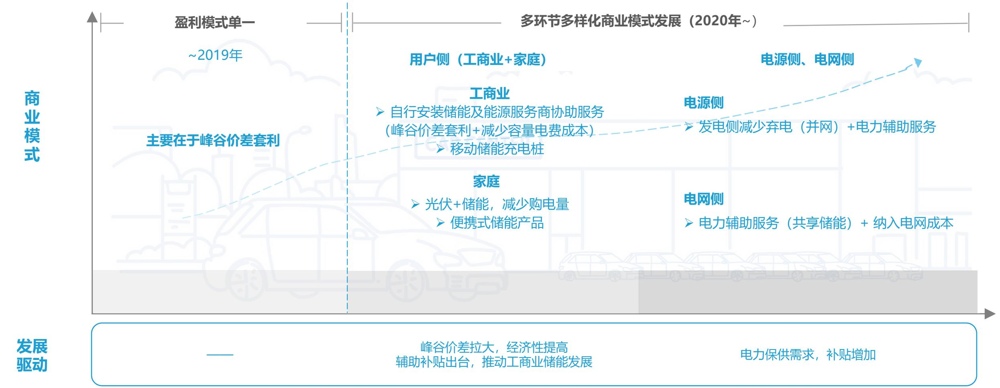  
亿欧智库：中国储能市场商业模式发展历程

# 电源侧：以生物发电、光伏发电、风力发电和水力发电搭配储能系统的新型储能为大趋势

$\Leftrightarrow$  电源侧储能的主要应用指在风电厂、火电厂、光伏电站、水力发电站等设立电储能设施，减少弃风弃光、辅助新能并网及提升电厂的调节性能弥补电机组效率，其中火电  $+$  储能系统联合调频作为目前国内实践较多的项目，对构建智能电网并改善电网对可再生能源的接纳能力也具有重要意义。  
$\Leftrightarrow$  除此之外，政策强制配储叠加政策补贴有效地提升了电源侧市场化经济性，新型储能主体基于建设周期短、选址简单灵活、调节性强、与新能源开发消纳匹配性好，也成为国家加快推进的模式之一，其商业模式也逐步成熟。

# 亿欧智库：电源侧火电储能联合调频

在政策大力支持下，火电站配置电化学储能提供调频等辅助服务的经济性备受瞩目。

但也存在一些限制因素，调频辅助服务市场空间相比于电能量调节市场空间较小，大量储能技术涌入调频市场必然对调频价格造成较大冲击。

从现状态势来看，装机规模较大、自身调节能力较强的火电机组更有优势，他们在进行储能配置的改造后，收益也会更有保障。

从长期来看，随着顶层设计、配套机制的不断完善，火储联调未来还会拓展到一次调频市场，从而进一步拓宽盈利渠道，收益空间也会更加明朗。

# 亿欧智库：电源侧新能源按比配储

按比例配储的新能源场站，也可以分为两类模式：

第一类：通过峰谷套利的方式获得可观的收益，降低地方电网峰谷差，实现新能源大范围、长距离的稳定消纳

第二类：通过绿电交易、绿证和碳交易市场，获得附加利益和竞争优势

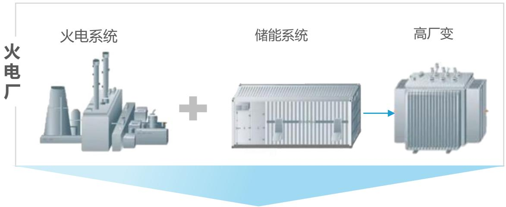  
电网

国内大部分的主力火电机组已经完成了提高快速调频性能优化项目，对适应新型绿色能源的迅猛发展、充分利用新型绿色能源、抵消新型绿色能源大规模接入电网的不稳定性问题、保障电网提供安全稳定的电力供应发挥出了实质性的作用

# 实践案例：浙江"火储协调控制+电池能量管理"系统显著改善电网对可再生能源的接纳能力

$\Leftrightarrow$  作为浙江首个电源侧火储协调控制  $+$  电池能量管理"系统，项目建设规模为20兆瓦/20兆瓦时，采用磷酸铁锂电池储能系统、预制舱室外安装形式，接入浙能乐电1、2号发电机组系统。浙能乐电1、2号机组电化学储能调频项目首次并网一次成功，同日完成与电网调度远动信息点的联调工作。  
$\Leftrightarrow$  改项目整体建设用时仅102天，期间涵盖梅雨天气及疫情等影响，也再次佐证了电源侧新型储能主体的经济性与时效性。

# 亿欧智库：浙江"火储协调控制+电池能量管理"系统

# 体现新型储能三大优势

# 极具拓展性和延伸性

该项目属浙江省内首次采用可开放性及可升级性"火储协调控制  $+$  电池能量管理"系统项目。

# 无人值守保障安全

# 最大程度保障了工作人员的安全

采用"无人值守"以及电池预制舱免步入式、无过道、外开门设计的储能项目，可最大限度保证运行维护人员安全。

# 效率、性能提升

# 整体联调后，调频效果将达到：

水电机组的1.4倍、天然气机组的2.3倍、燃煤机组的20倍以上

# 电网侧：具备独立运行条件，独立共享储能商业模式前景可期

$\diamond$  "共享储能"概念源于青海省于2018年提出，是指由第三方投资建设的集中式大型独立储能电站，除了满足自身电站需求外，也为其它新能源电站提供服务；电站通过双边协商、双边竞价及单边调用等模式参与电力交易，降低新能源场站弃电量，并参与电力辅助服务市场。  
$\Leftrightarrow$  由电网侧统一配置协调分散在电网侧、电源侧、用户侧储能电站资源，通过实时联合调度控制和灵活统一的商业运营，在满足各方自身需求的同时，实现多方共赢和储能资源的最大化利用。  
$\Leftrightarrow$  电网侧的独立共享储能模式作为目前已经落地的商业模式，投资主体明确，模式灵活性、适用性、覆盖性都较有优势，也可有效提高储能利用率和储能项目收益率，也更容易参与电力市场辅助服务及现货市场，推动资本对储能电站投资积极性。

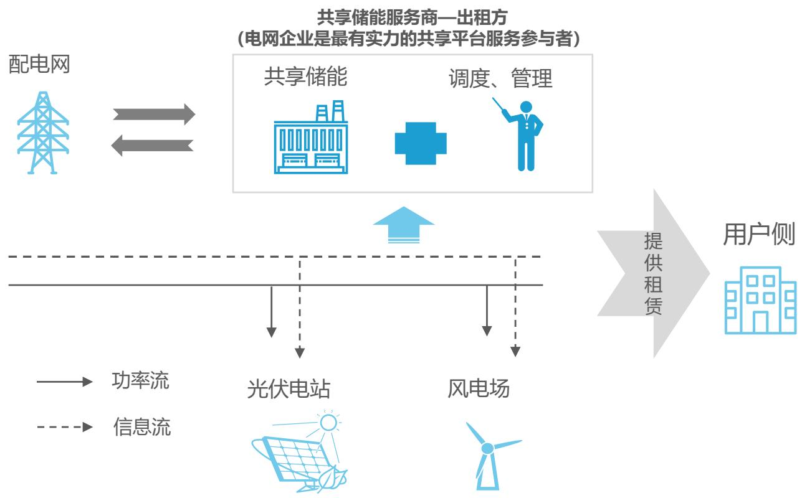  
亿欧智库：电网侧独立共享储能模式

# 运营模式：

出租方将储能系统的功率和容量以商品形式租赁给目标用户，秉承"谁受益、谁付费"的原则向用户收取租金

# 出租方-共享储能服务商权益：

容量租赁费用是服务商稳定的收入来源，国内一般在250-350元/kW/年之间。（例如100MW的共享储能电站，容量租赁费用可达2500-3500万元/年）

# 承租方-用户侧权益：

在服务时限内享有储能充放电权力来满足自身供能需求，无需自主建设储能电站，大幅减低原始资金投入

# 实践案例：青海共享储能解决弃风弃光电量计算、线损电量计算等问题

$\Leftrightarrow$  青海共享储能突破传统储能电站的整体运营理念，以单个PCS为最小的共享储能单元解决了弃风弃光电量计算、线损电量计算等问题。以储能市场化交易和调峰辅助服务市场交易两种商业化运营模式，建成共享储能市场化交易平台和区块链平台。截至2022年7月底，青海电网并网的电化学储能容量达到了49.9万千瓦时，共享储能市场累计成交2648笔，新能源场站增发电量7286万kW·h，进一步证明了共享储能的商业化前景可期。  
$\diamond$  目前青海电网两座共享储能电站分别为：中国绿发与上海闵行都位于海西新能源基地。基于海西地区阴晴不定的天气特点和新能源发电不稳定性，青海电网应用利用率更高的"按断面负载率"充放电控制策略：当海西、宁月宁塔康继恒营双回断面负载率超过  $96\%$  时，共享储能电站开始充电，并在断面负载率小于等于  $80\%$  时开始放电，充放电模式由此前的每日"一充一放"转变为"浅充浅放""多充多放"，共享储能电站利用率也明显提升。

  
打造了基于区块链的共享储能应用平台保障储能交易安全性透明性

国网青海电力利用区块链技术的特性，将其引入共享储能辅助服务交易，保障共享储能交易的安全性、可追溯性，给市场建立更多信心。

平台通过区块链分布式存储、加密技术、共识算法和智能合约，将新能源受阻电力、电量与储能系统接收电力、电量通过信息技术采集过程记录在区块链上，并实现可视化和可追溯，完成多主体间的交易结果清分。

  
"固定晚高峰"调整成"按断面负载率"充放实现"三充三放"提升储能站利用效率

2022年国网青海电力将共享储能电站由"固定晚高峰"充放电模式调整为"按断面负载率"。据统计，2022年2月-5月，青海电网共享储能电站实施"按断面负载率"充放电模式后，满充满放率由2020年的71.00%提升至90.08%

采用新模式后，青海共享储能电站最大利用率达  $199\%$

基于海西天气不定，海西、宁月塔青断面负载率多次超过  $96\%$  。位于海西地区的中国绿发与上海闵行两个共享储能电站在调整充放电控制策略后，首次实现日内"三充三放"，打破了储能电站通常每日最多实现一次满充满放的瓶颈。

# 用户侧-家庭：以安装"光伏+储能"设备与购买户外便携式储能为主，处于发展初期

$\diamond$  用户侧的家庭储能涵盖"光伏+储能"、便携式储能产品两种主流模式，主要购买力来自家庭或个人。  
$\Leftrightarrow$  便携式储能主要指便携式电池应用，主要应用在户外活动和应急。便携式储能的主力市场目前较为小众，也以欧洲北美为主，韩国、日本逐步兴起。  
$\Leftrightarrow$  光伏  $+$  储能主要通过在家居房屋安装光伏发电设备，在白天利用光伏设备发电供给家庭用电，从而减少外购电的费用，但目前多应用于海外。

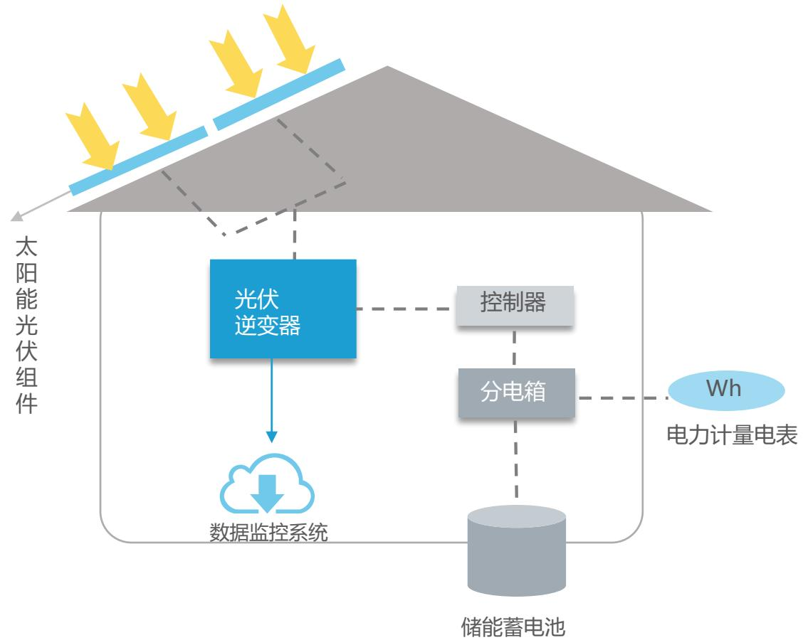  
亿欧智库：家庭光伏+储能应用示例  
限制性：光伏发电存在固有的间歇性和波动性，影响电网的稳定性

# 商业化现状：处于市场初步发展阶段，市场空间大

作为分布式光伏发电的主要形式，户用光伏系统已在国外得到成功推广。在中国，处于初步发展阶段，目前也有互联网巨头入局家庭储能，例如华为。对于便携式储能，也有独角兽企业启动上市，随着国家政策利好，我国分布式光伏发电市场份额稳步提升，用户侧家庭储能逐步走进消费者视线，在市场培育进一步渗透后，将会持续保持高速增长。

  
亿欧智库：户外便携式储能应用示例  
便携式储能产品  
可同时支持多设备，多线接入同时放电使用

# 用户侧-工商业：以自建设备与服务端协助设备建设商业模式为主，需求已逐渐激发

$\Leftrightarrow$  作为用户侧储能重要构成之一，工商业储能大多数实行一体化（一体柜）建造，主要目的在于满足工商业自身的电力需求，实现光伏发电最大化自发自用、以及通过低储高发的方式减少自身电费支出，同时也为突发性停电故障进行后备保障，对于多数工商业用户而言，适用性极强。  
$\diamond$  在这种模式下，工商业用户可有效利用国内电力市场峰谷电价、可中断电价等价格机制进行低谷储能，在高负载时进行供给，降低用电成本。  
$\diamond$  目前对于工商业储能主要有两种商业模式。第一种：由工商业用户自行安装储能设备，可以直接减少用电成本，但是用户需要承担初始投资成本及每年的设备维护成本。第二种：由能源服务企业协助用户安装储能，能源服务企业投资建设储能资产并负责运维，工商业用户向能源服务企业支付用电成本。

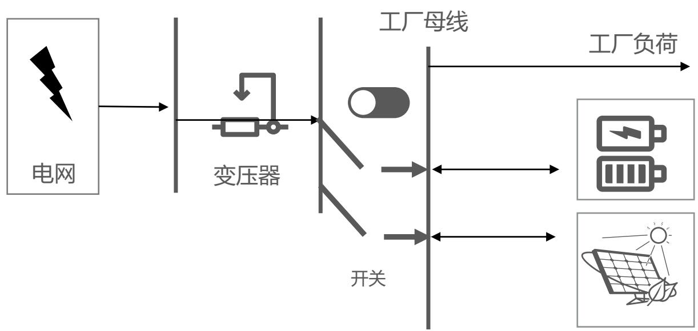  
亿欧智库：工商业储能示意图

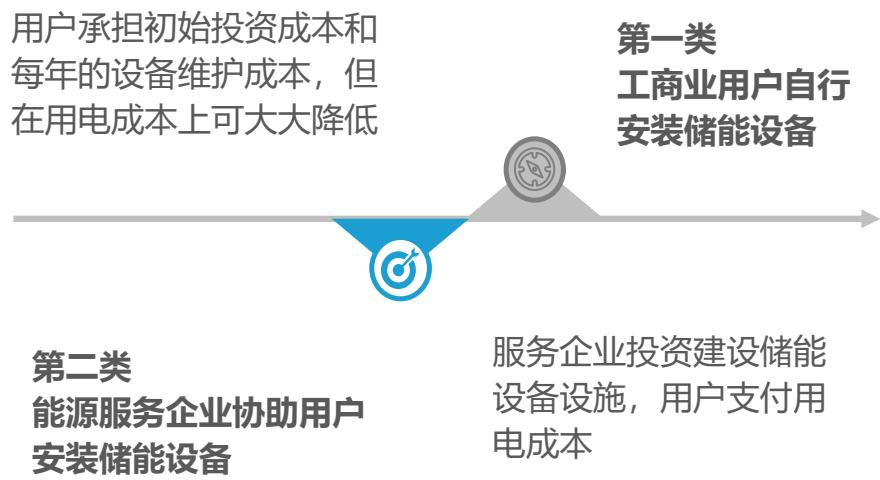  
亿欧智库：工商业储能主流商业模式

# 实践案例：科林产业园综合能源微电网利用园区内地热资源提供分布式冷热联供服务

$\Leftrightarrow$  科林产业园综合能源微电网利用园区内地热资源提供分布式冷热联供服务，降低空调制冷的用能成本，解决了园区城市热网无法覆盖难题  
$\Leftrightarrow$  基于商业用户的用能需求以及园区自身条件限制，统一建设了配电网络、分布式屋面光伏发电系统、地源热泵冷热联供系统、锂电池储能系统以及电动汽车充电设施，并设立综合能源管控系统平台进行全流程管控，实现能源流与信息流的融合可视化。

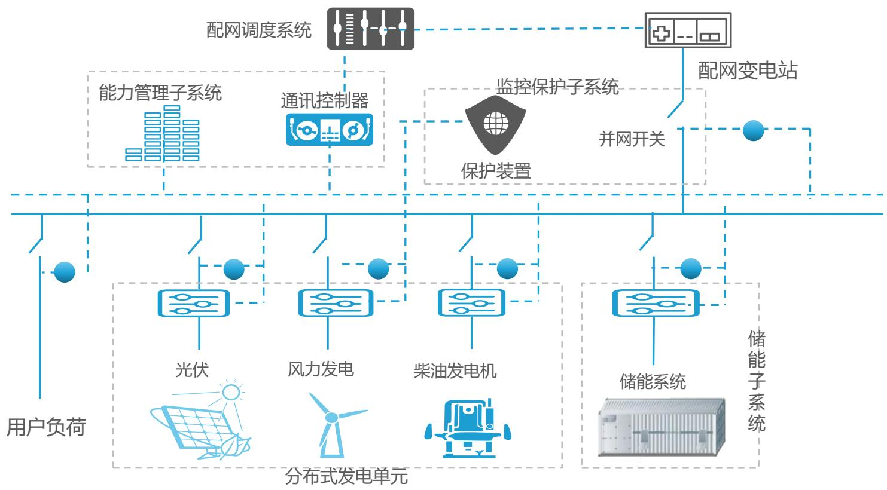  
亿欧智库：分布式发电与智能微网建设情况及应用

项目建设工商业园区级（冷、热、电）微型综合能源网络，具备能源生产、供应销售、调控优化等综合管理功能。

在引入市电10kV电源的同时，建设园区高低压配网系统，以分配电能，从而满足园区生产生活等的不同用电需求。

此外，项目利用园区内地热资源提供分布式冷热联供服务，降低空调制冷的用能成本，解决园区城市热网无法覆盖的问题。

在新能源方面，项目利用园区大型厂房屋顶建设分布式光伏发电系统作为市电补充，并建设大型电动汽车充电站，满足园区及周边过往社会车辆快速充电需求。

园区综合能源管控平台可对整个分布式能源网络进行管控和优化，同时结合远期规划的储能系统，最终建设了具备源、网、荷、储、控各个要素的并网型园区级综合能源微网。

# 新能源装机规模的提高将用电核心矛盾转向尖峰负荷，储能需与其他解决方案协同支撑

从2020年习总书记在联合国大会上提出"碳中和"发展目标，2021年以来发电侧的风电、光伏发电迎来了高速发展。风电、光伏等可再生能源大规模并网，发电侧可控性变差，且分布式电源容量小、数据多，分散通过低压配网并网，改变了传统集中式大规模受控发电的电力系统结构，电力系统由"源随荷动"向"源荷互动"转变。  
$\diamond$  目前，新能源装机量的提升我国发电装机量达到了约26亿千瓦，但仍然无法解决13亿的尖峰负荷缺电问题，尖峰负荷成为了新的用电矛盾。

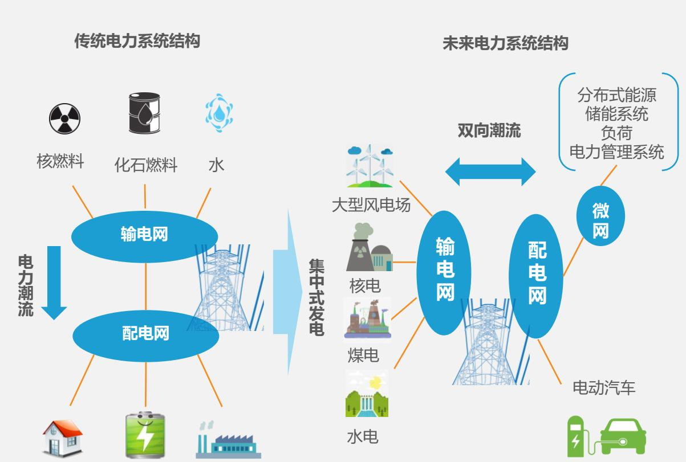  
亿欧智库：电力系统由"源随荷动"向"源荷互动"转变

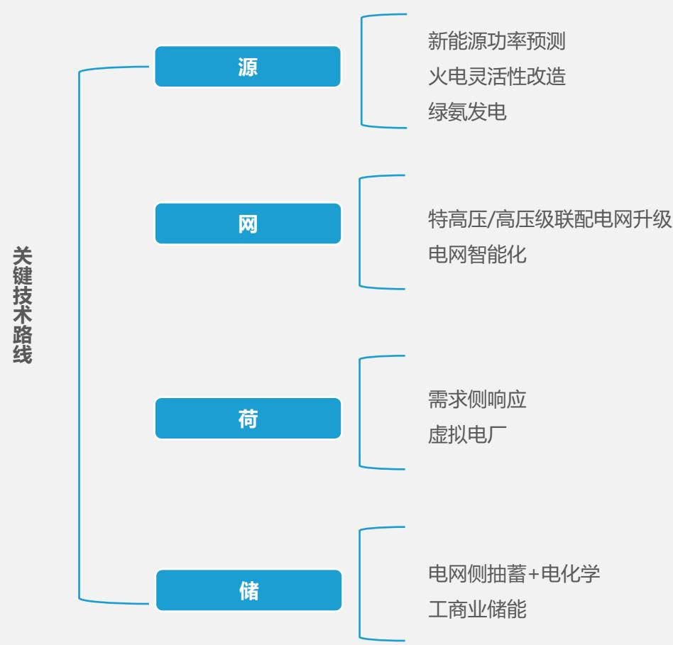  
亿欧智库：储能技术是尖峰负荷核心技术之一

# 虚拟电厂是储能的重要补充，储能+虚拟电厂将是未来电网调峰调频的重要有效途径

$\Leftrightarrow$  系统能否在高比例波动可再生能源的情况下灵活运行，是电力系统转型的核心，且对于确保现代电力系统的安全性至关重要。不管是发电侧的电化学储能、火电的灵活性改造，还是电网侧的抽水蓄能，用电侧的需求侧响应，到虚拟电厂，都是在解决新能源上网对电网造成的巨大负荷，为电网调峰调频的重要有效途径，虚拟电厂是储能的重要补充。  
$\Leftrightarrow$  虚拟电厂将依托互联网和现代信息通讯技术，把分布式电源、储能、负荷等分散在电网的各类资源相聚合，进行协同优化运行控制和市场交易，实现电源侧的多能互补、负荷侧的灵活互动，对电网提供调峰、调频、备用等辅助服务。

亿欧智库：调峰调频手段对比  

<table><tr><td>提升手段</td><td>优势</td><td>不足</td></tr><tr><td>火电灵活性改造</td><td>·单位调节容量投资小，调峰能力提升显著
·配合检修同步进行，周期短见效快
·改造的技术方案成熟，提升空间大</td><td>·配套政策与机制依赖性较高
·响应调节速度慢，冷启动需5小时</td></tr><tr><td>抽水蓄能电站</td><td>·启动速度快
·不仅提升灵活性，还能作为事故备用和黑启动电源</td><td>·抽发损失25%，使用成本高
·地理条件受限</td></tr><tr><td>电化学储能站</td><td>·全自动化控制，响应快速
·控制精度高，可全容量调节</td><td>·缺乏转动惯量，不利于控制电网频率
·前期投资高，性价比较低
·目前尚不具备大规模建设条件</td></tr><tr><td>需求侧响应</td><td>·潜力大
·前景好</td><td>·价格信号传导机制形成需要较长时间
·提升效果存在不确定性
·需求侧资源可控性相对较差
·响应效果难以精确计量，有争议</td></tr></table>

亿欧智库：虚拟电厂与真实电厂的比较  

<table><tr><td></td><td>虚拟电厂</td><td>电厂</td></tr><tr><td>调节手段</td><td>调增出力、调减负荷</td><td>调节出力</td></tr><tr><td>电能量市场</td><td>负荷削峰为主，可参与电力市场</td><td>中长期、现货电力交易</td></tr><tr><td>辅助服务市场</td><td>以调峰为主，能力可拓展</td><td>调峰、调频、备用、调压等</td></tr><tr><td>容量市场</td><td>容量补偿</td><td>容量补偿</td></tr><tr><td>调节资源</td><td>分布式电源、储能、充电桩、可调节负荷</td><td>火电厂、风电、光伏</td></tr></table>

# 目前储能市场面临多重痛点，需分阶段推进储能电站参与电力市场

储能电站参与电力市场的类型主要包括电量市场、辅助服务市场和容量市场，发挥储能综合价值，实现多重收入。目前，在现有的电力市场框架和规则下，储能电站可参与中长期电量交易，调频、调峰辅助服务市场交易。从实际成效来看，我国储能电站投资建设成本仍然较高，在单一市场中的利用率较低，多重价值、系统价值难以得到全面体现，在市场上难以与其他替代资源竞争。

# 亿欧智库：储能市场痛点

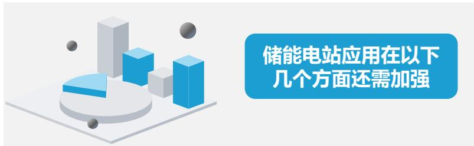

发展规划上，我国提出了储能量化目标，下一步需重点结合电力系统实际需求明确储能电站的布局，特别是统筹电网、抽水蓄能和各类其他灵活性资源，将储能电站规划纳入电网规划，引导储能电站合理布局、有序发展。

市场准入上，储能电站参与电力现货交易市场的主体身份、准入条件还有待明确，交易规则还有待完善。配置储能已成为部分地区新能源优先开发的重要条件，新能源配置储能的应用范围有待扩展。

价格机制上，储能电站电价政策缺失，目前我国尚未出台储能电站相关的充电价格、上网电价、输配电价政策。在构建新型电力系统过程中，用于保障电力系统安全、电力可靠供应的储能电站难以从市场获利。目前，对此类储能的发展尚无相关的支持政策。

# 亿欧智库：推进储能电站参与电力市场三大阶段

# 第一阶段：当前电力市场环境

完善辅助服务市场交易机制：应在常规调峰、调频市场建设基础上，根据系统运行需要，制订转动惯量、爬坡等辅助服务新品种的交易规则  
- 发挥储能电站动态响应技术优势：充分发挥储能电站响应速度快、布置灵活等技术优势，为调动储能电站系统调节能力创造市场条件

# 第二阶段：电力现货市场初极阶段

完善电能量交易规则：允许储能电站在内的各类资源公平参与电力现货市场  
- 发挥储能电站跨时间调节能力：完善价格机制，明确储能电站充放电价、输配电价政策，利用价格信号调动储能电站参与电网调峰  
提升储能在电力现货市场上的盈利水平：发挥新能源边际成本基本为零的优势，共同参与电力现货交易

# 第三阶段：电力现货市场成熟阶段

- 让储能电站在多个市场中发挥多重价

值：储能电站可全面参与电量市场、辅助服务市场和容量市场，提供不同时间尺度的调节服务

拓展储能电站应用新业态、新模式：拓展智慧能源，虚拟电厂等包含储能电站的新业态、新模式，实现储能电站多元化发展

